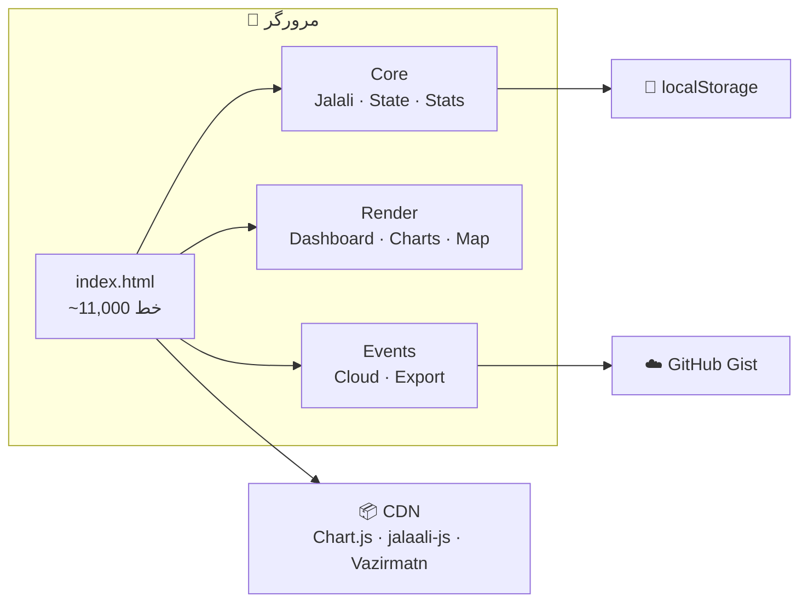

<div dir="rtl" align="right">

# 🏃 Sport Report

<p align="center">
  <strong>اپلیکیشن شخصی ثبت و تحلیل ورزش، خواب و انرژی — با تقویم شمسی</strong>
</p>

<p align="center">

[](https://abbasahmadizade.github.io/my-sport-reports-only/)
[](#)
[](#)
[](#)

</p>

> **۱۰۰٪ از ایران بدون VPN کار می‌کنه** ✅ &nbsp;|&nbsp; [دمو زنده 🚀](https://abbasahmadizade.github.io/my-sport-reports-only/)

<p align="center">
  <em>ساخته‌شده با ❤️ توسط <a href="https://arena.ai">Arena.ai</a></em>
</p>

---

## ✨ امکانات

| | | |
|---|---|---|
| 🔐 | **Login با SHA-256** | رمز + salt تصادفی، session ۷ روزه |
| ☁️ | **Cloud Sync** | همگام‌سازی با GitHub Gist — بدون فیلتر |
| 🗺️ | **نقشه فعالیت** | GitHub-style، گرادیان ۵ سطح، tooltip فارسی |
| ⏱️ | **ورود mm:ss** | ثبت دقیقه:ثانیه برای دویدن و پیاده‌روی |
| 📊 | **۸ نمودار** | Line / Bar / Radar / Scatter / Heatmap |
| 🧠 | **تحلیل هوشمند** | Readiness Score + ۸ سناریو زمانی |
| 📤 | **Export** | AI / Markdown / JSON / CSV |
| 🎨 | **۵ تم + ۴ فونت** | دارک RTL، کاملاً فارسی |
| 📱 | **موبایل‌فرست** | Responsive از 320px |

---

## 🏗️ معماری



```
index.html
├── <style>         ── تم، RTL، کامپوننت‌ها
├── <script> 1-3   ── Core (Jalali · State · Stats · Helpers)
├── <script> 4     ── Render (Dashboard · Log · Charts · Map)
└── <script> 5     ── Events · Cloud · Export
```

---

## 🗺️ نقشه فعالیت

<div dir="ltr" align="center">

```
         فروردین           اردیبهشت            خرداد              تیر
    ┌─────────────────┬─────────────────┬─────────────────┬─────────────────┐
 ش  │ ▓ ░ ░ ▓ ░ ░ ▓  │ ░ ▓ ▓ ░ ░ ▓ ░  │ ▓ ░ ░ ░ ▓ ▓ ░  │ ░ ░ ▓ ▓ ░ ░ ░  │
 ج  │ ░ ▓ ░ ░ ▓ ░ ░  │ ▓ ░ ░ ▓ ░ ░ ▓  │ ░ ▓ ░ ▓ ░ ░ ▓  │ ▓ ░ ░ ░ ▓ ░ ░  │
 ۳  │ ░ ░ ▓ ░ ░ ▓ ░  │ ░ ░ ▓ ░ ░ ▓ ░  │ ░ ░ ▓ ░ ░ ▓ ░  │ ░ ▓ ░ ░ ░ ▓ ░  │
 پ  │ ▓ ░ ░ ▓ ░ ░ ▓  │ ░ ▓ ░ ░ ▓ ░ ░  │ ▓ ░ ░ ▓ ░ ░ ░  │ ░ ░ ▓ ░ ░ ░ ▓  │
 ۵  │ ░ ▓ ░ ░ ▓ ░ ░  │ ░ ░ ▓ ░ ░ ▓ ▓  │ ░ ▓ ░ ░ ▓ ▓ ░  │ ░ ░ ░ ▓ ▓ ░ ░  │
 ۶  │ ░ ░ ▓ ░ ░ ▓ ░  │ ▓ ░ ░ ▓ ░ ░ ░  │ ░ ░ ▓ ░ ░ ░ ▓  │ ▓ ░ ░ ░ ░ ▓ ░  │
 ۷  │ ░ ░ ░ ▓ ░ ░ ▓  │ ░ ░ ▓ ░ ░ ░ ▓  │ ▓ ░ ░ ▓ ░ ░ ░  │ ░ ▓ ░ ░ ░ ░ ▓  │
    └─────────────────┴─────────────────┴─────────────────┴─────────────────┘
```
</div>

**فرمول امتیاز هر روز:**

| شرط | امتیاز |
|---|:---:|
| روز کامل (completed) | +35 |
| دویدن ≥ ۵ دقیقه | +20 |
| فعالیت ≥ هدف | +15 |
| خواب ≥ هدف | +15 |
| (انرژی ÷ ۱۰) × ۱۵ | +15 |
| **حداکثر** | **100** |

---

## 📊 نمودارها

<div dir="rtl" align="right">

| # | نمودار | نوع | توضیح |
|---|--------|:---:|---|
| 1 | 😴 خواب | Line | روند خواب + میانگین متحرک ۷ روزه + خط هدف |
| 2 | ⚡ انرژی و حال | Line | دو محور + MA7 |
| 3 | 🏃 فعالیت | Stacked Bar | دویدن + پیاده‌روی |
| 4 | 🔥 هیت‌مپ خواب | Heatmap | ۶ سطح رنگی، شب × روز هفته |
| 5 | 🌙 ساعت خواب | Scatter | زمان خواب و بیداری |
| 6 | 📅 مقایسه هفتگی | Grouped Bar | ۵ متریک در کنار هم |
| 7 | 🕸️ رادار | Radar | ۳ هفته آخر، ۵ محور |
| 8 | 🔬 همبستگی | Scatter | خواب امشب ← → انرژی فردا |

</div>

---

## 🧠 تحلیل هوشمند

<div dir="rtl" align="right">

**Readiness Score:**

```
  خواب (40%)  +  انرژی (35%)  +  ثبات (25%)  =  Readiness
```

| امتیاز | سطح | نماد |
|:---:|---|:---:|
| ۷۵+ | شدید | 💪 |
| ۵۵–۷۵ | متوسط | ⚡ |
| ۳۵–۵۵ | سبک | 🚶 |
| <۳۵ | استراحت | 🧘 |

**بهترین ساعات فعالیت:**

```
 🌅 5–9    │ بهترین — کورتیزول صبحگاهی
 ☀️ 9–12   │ شدت متوسط تا زیاد
 🌞 12–15  │ احتیاط — گرما
 🌤️ 15–18  │ ⭐ اوج علمی — قدرت و سرعت
 🌆 18–21  │ سبک تا متوسط
 🌙 21–24  │ استرچ + آماده خواب
 🌃 0–3    │ تنفس ۴-۷-۸
 🌌 3–5    │ تلاش برای خواب
```

</div>

---

## ☁️ همگام‌سازی ابری

<div dir="rtl" align="right">

**چرا GitHub Gist؟** رایگان کامل · بدون محدودیت request · بدون فیلتر از ایران · تاریخچه تغییرات

**راه‌اندازی:** Token با scope `gist` بساز → Gist خصوصی ایجاد کن → Token + Gist ID رو تو تنظیمات بذار

```javascript
// Upload
PATCH https://api.github.com/gists/{gistId}
Body: { files: { "sport-data.json": { content: JSON } } }

// Download
GET https://api.github.com/gists/{gistId}
```

</div>

---

## 📦 مدل داده

<div dir="ltr" align="left">

```typescript
{
  rows: [{
    id: number,                // Date.now()
    jdate: string,             // "1405-04-27"
    completed: boolean,
    energy: number,            // 0–10
    mood: number,              // 0–10
    runMin: number,            // اعشاری: 1.17 = 1 دقیقه 10 ثانیه
    walkMin: number,
    longestRun: number,
    activity: string,
    note: string,
    futsalRef: boolean,
    sleepBlocks: [{ label, start, end }],
    officialWake: string | null
  }],
  futsal: [{ id, jdate, energyBefore, energyAfter, durationActual, intensity }],
  goals: { sleepGoalHours: 7, activityGoalMin: 20 },
  programGoal: string
}
```

</div>

> ⚠️ `runMin` به صورت اعشاری ذخیره می‌شه — `formatMin()` اون رو به `mm:ss` تبدیل می‌کنه

---

## 🚀 نصب

```bash
git clone https://github.com/abbasahmadizade/my-sport-reports-only.git
cd my-sport-reports-only
open index.html
```

یا مستقیم از [GitHub Pages](https://abbasahmadizade.github.io/my-sport-reports-only/) استفاده کن.

---

## 🔧 Debug

<div dir="rtl" align="right">

```javascript
window._app.runHealthCheck()                    // وضعیت کلی
console.log(window._app.state().rows.length)    // تعداد رکوردها
cloudUpload(false)                               // force sync
localStorage.removeItem('sport_auth_v1');        // reset رمز
localStorage.removeItem('sport_session_v1'); location.reload()
```

</div>

---

## 📅 Changelog

<div dir="rtl" align="right">

<details open>
<summary><b>v5.2</b> — ۱۴۰۵/۰۴/۲۷ (اخیر)</summary>
<br>

✨ نقشه فعالیت GitHub-style · ✨ ورود mm:ss · ✨ `formatMin()` · ⚡ مهاجرت به GitHub Gist · 🐛 CORS fix

</details>

<details>
<summary><b>v5.0</b> — ۱۴۰۵/۰۴/۲۰</summary>
<br>

✨ بازطراحی UI · ✨ ۸ نمودار · ✨ Health Check · ✨ یادآور backup

</details>

<details>
<summary><b>v4.0</b> — ۱۴۰۵/۰۳/۰۱</summary>
<br>

✨ Cloud sync · ✨ تحلیل هوشمند · ✨ Login SHA-256

</details>

</div>

---

<div dir="rtl" align="center">

### 🙏 با تشکر

[Chart.js](https://www.chartjs.org/) · [jalaali-js](https://github.com/jalaali/jalaali-js) · [Vazirmatn](https://github.com/rastikerdar/vazirmatn-font) · [GitHub Gist API](https://docs.github.com/en/rest/gists)

---

<p align="center">
  <strong>ساخته‌شده با ❤️ در ایران</strong><br><br>
  این پروژه با کمک <a href="https://arena.ai"><strong>Arena.ai</strong></a> توسعه داده شده است.<br>
  <sub>کدنویسی و معماری توسط AI — نظارت و ایده‌پردازی توسط توسعه‌دهنده</sub>
</p>

[](https://github.com/abbasahmadizade/my-sport-reports-only/stargazers)
[](https://github.com/abbasahmadizade/my-sport-reports-only/network/members)

</div>
