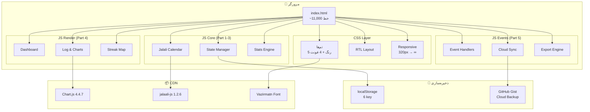
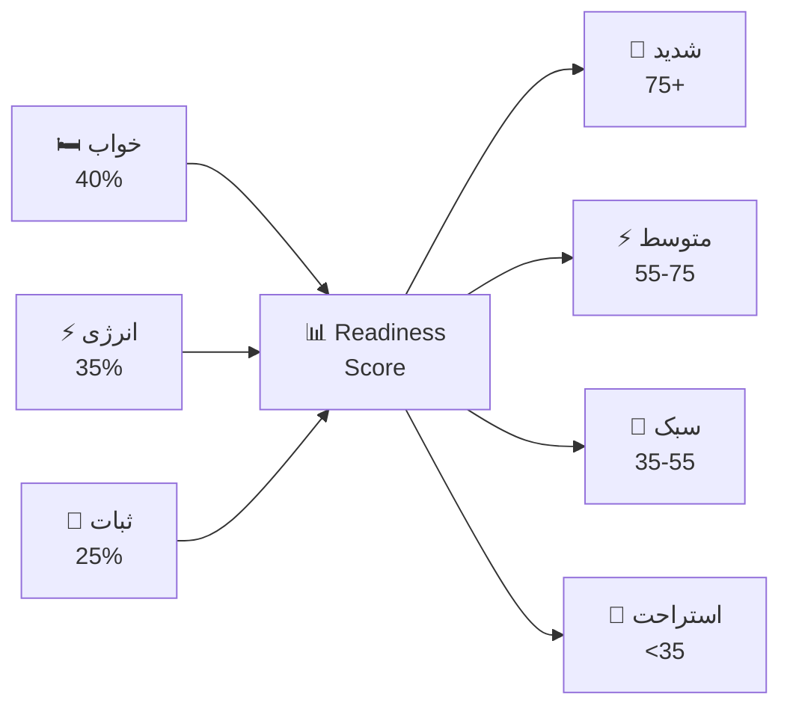
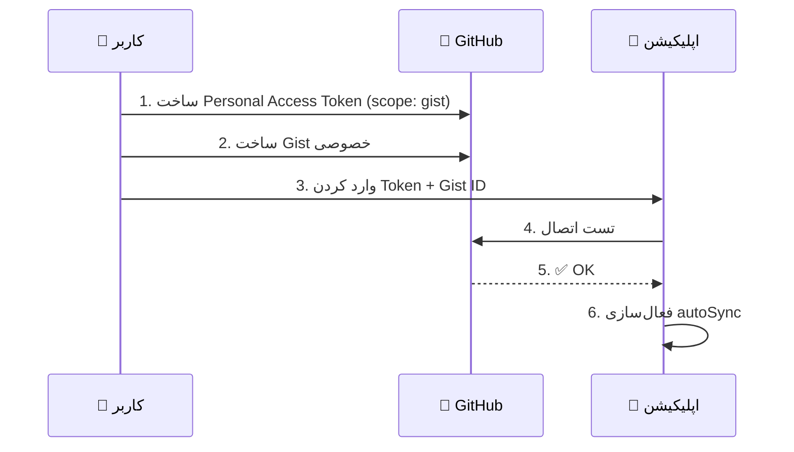

# 🏃 Sport Report

### اپلیکیشن شخصی ثبت و تحلیل ورزش، خواب و انرژی

[](https://abbasahmadizade.github.io/my-sport-reports-only/)
[](#)
[](#)
[](#)
[](#)

**پلتفرم:** موبایل + دسکتاپ &nbsp;|&nbsp; **تقویم:** شمسی &nbsp;|&nbsp; **زبان:** فارسی

[دمو زنده 🚀](https://abbasahmadizade.github.io/my-sport-reports-only/) &nbsp;•&nbsp;
[گزارش باگ 🐛](https://github.com/abbasahmadizade/my-sport-reports-only/issues) &nbsp;•&nbsp;
[درخواست ویژگی ✨](https://github.com/abbasahmadizade/my-sport-reports-only/issues)

---

**۱۰۰٪ از ایران بدون VPN کار می‌کنه** ✅

</div>

---

## 📑 فهرست

- [نمای کلی](#-نمای-کلی)
- [ویژگی‌ها](#-ویژگی‌ها)
- [نماگرفت‌ها](#-نماگرفت‌ها)
- [معماری](#-معماری)
- [نقشه فعالیت](#-نقشه-فعالیت)
- [نمودارها](#-۸-نمودار-پیشرفته)
- [تحلیل هوشمند](#-تحلیل-هوشمند)
- [همگام‌سازی ابری](#-همگام‌سازی-ابری)
- [مدل داده](#-مدل-داده)
- [نصب و راه‌اندازی](#-نصب-و-راه‌اندازی)
- [توسعه](#-راهنمای-توسعه)
- [Changelog](#-changelog)
- [Credits](#-credits)

---

## 🔎 نمای کلی

یک اپلیکیشن تک‌فایل HTML برای ثبت روزانه **ورزش**، **خواب**، **انرژی** و **فوتسال** — با تقویم شمسی، ۸ نمودار تعاملی، نقشه فعالیت GitHub-style، sync ابری از طریق GitHub Gist، و تحلیل هوشمند Readiness Score.

> بدون فریم‌ورک، بدون بیلد، بدون بک‌اند. فقط یک فایل `index.html` و یک مرورگر.

---

## ✨ ویژگی‌ها

<table>
<tr>
<td width="50%">

### 🔐 امنیت و حساب
- Login با **SHA-256** + salt تصادفی
- Session ۷ روزه با تمدید خودکار
- داده‌ها در **localStorage** رمزنگاری‌شده

### 🗓️ تقویم شمسی
- محاسبه دقیق تاریخ جلالی
- فلش‌های ناوبری ماه/هفته
- نام روز هفته فارسی
- برچسب ماه‌ها روی نقشه فعالیت

</td>
<td width="50%">

### ☁️ همگام‌سازی
- **GitHub Gist** — بدون فیلتر از ایران
- Sync خودکار + دستی
- تاریخچه تغییرات روی Gist
- بدون محدودیت request

### 📱 رابط کاربری
- **Mobile-first** — از 320px تا دسکتاپ
- ۵ تم رنگی + ۴ فونت فارسی
- Bottom Navigation موبایل
- کاملاً RTL

</td>
</tr>
</table>

---

## 📸 نماگرفت‌ها

<div align="center">

> _برای اضافه کردن اسکرین‌شات‌ها، فایل‌های تصویر را در پوشه `docs/` قرار دهید_

| داشبورد | ثبت روزانه |
|:---:|:---:|
| `docs/dashboard.png` | `docs/log.png` |

| نمودارها | نقشه فعالیت |
|:---:|:---:|
| `docs/charts.png` | `docs/streak-map.png` |

</div>

---

## 🏗️ معماری



### ساختار فایل

```
index.html
├── <style>         ── تم، RTL، کامپوننت‌ها
├── <script> Part 1 ── Jalali Calendar Engine
├── <script> Part 2 ── State Management + Stats
├── <script> Part 3 ── Helpers (formatMin, sleepInfo, ...)
├── <script> Part 4 ── Render (Dashboard, Log, Charts, Map)
└── <script> Part 5 ── Events, Cloud Sync, Export
```

### localStorage Keys

| Key | محتوا |
|---|---|
| `sport_report_v2` | دیتای اصلی (rows, futsal, goals) |
| `sport_cloud_v2` | تنظیمات ابر (`token`, `gistId`, `autoSync`) |
| `sport_auth_v1` | احراز هویت (`username`, `hash`, `salt`) |
| `sport_session_v1` | Session (`t`: timestamp) |
| `sport_last_backup_v1` | Timestamp آخرین بکاپ |
| `sport_accent_v3` | تم رنگی فعال |
| `sport_font_v1` | فونت انتخابی |

---

## 🗺️ نقشه فعالیت

نقشه فعالیت به سبک **GitHub Contribution Graph** با پنجره متحرک بر اساس عرض صفحه:

```
         فروردین          اردیبهشت           خرداد            تیر
    ┌────────────────┬────────────────┬────────────────┬────────────────┐
 ش  │ ▓ ░ ░ ▓ ░ ░ ▓ │ ░ ▓ ▓ ░ ░ ▓ ░ │ ▓ ░ ░ ░ ▓ ▓ ░ │ ░ ░ ▓ ▓ ░ ░ ░ │
 ج  │ ░ ▓ ░ ░ ▓ ░ ░ │ ▓ ░ ░ ▓ ░ ░ ▓ │ ░ ▓ ░ ▓ ░ ░ ▓ │ ▓ ░ ░ ░ ▓ ░ ░ │
 ۳  │ ░ ░ ▓ ░ ░ ▓ ░ │ ░ ░ ▓ ░ ░ ▓ ░ │ ░ ░ ▓ ░ ░ ▓ ░ │ ░ ▓ ░ ░ ░ ▓ ░ │
 پ  │ ▓ ░ ░ ▓ ░ ░ ▓ │ ░ ▓ ░ ░ ▓ ░ ░ │ ▓ ░ ░ ▓ ░ ░ ░ │ ░ ░ ▓ ░ ░ ░ ▓ │
 ۵  │ ░ ▓ ░ ░ ▓ ░ ░ │ ░ ░ ▓ ░ ░ ▓ ▓ │ ░ ▓ ░ ░ ▓ ▓ ░ │ ░ ░ ░ ▓ ▓ ░ ░ │
 ۶  │ ░ ░ ▓ ░ ░ ▓ ░ │ ▓ ░ ░ ▓ ░ ░ ░ │ ░ ░ ▓ ░ ░ ░ ▓ │ ▓ ░ ░ ░ ░ ▓ ░ │
 ۷  │ ░ ░ ░ ▓ ░ ░ ▓ │ ░ ░ ▓ ░ ░ ░ ▓ │ ▓ ░ ░ ▓ ░ ░ ░ │ ░ ▓ ░ ░ ░ ░ ▓ │
    └────────────────┴────────────────┴────────────────┴────────────────┘
```

### فرمول امتیاز روز

```
┌─────────────────────────────────────────────┐
│           امتیاز فعالیت روزانه              │
├──────────────────────────────┬──────────────┤
│ completed = true             │    +35       │
│ دویدن ≥ ۵ دقیقه              │    +20       │
│ دویدن + پیاده ≥ هدف فعالیت  │    +15       │
│ خواب ≥ هدف خواب              │    +15       │
│ (energy / 10) × 15          │    +15       │
├──────────────────────────────┼──────────────┤
│ مجموع حداکثر                 │   100        │
└──────────────────────────────┴──────────────┘
```

**سطوح رنگی (۵ گرادیان):**

| سطح | امتیاز | نشان |
|:---:|:---:|:---:|
| ۰ | ۰ | ░ بدون فعالیت |
| ۱ | ۱–۲۵ | ▒ فعالیت سبک |
| ۲ | ۲۶–۵۰ | ▓ فعالیت متوسط |
| ۳ | ۵۱–۷۵ | █ فعالیت خوب |
| ۴ | ۷۶–۱۰۰ | **■** فعالیت عالی |

### ویژگی‌های نقشه
- 🎯 **Tooltip فارسی** — تاریخ، وضعیت، دویدن (mm:ss)، انرژی، امتیاز
- 👆 **Tap موبایل** — اول tooltip، دوم رفتن به اون روز
- ⚽ **فوتسال** — outline زرد روی خونه‌های فوتسال
- 📊 **کارت‌های آمار** — استریک فعلی، بهترین استریک، فعال‌ترین روز، ماه جاری

---

## 📊 ۸ نمودار پیشرفته

| # | نمودار | نوع | محور |
|---|--------|-----|------|
| 1️⃣ | 😴 خواب | Line + MA7 + هدف خطی | تاریخ → ساعت خواب |
| 2️⃣ | ⚡ انرژی و حال | Line دوگانه + MA7 | تاریخ → امتیاز ۰-۱۰ |
| 3️⃣ | 🏃 فعالیت | Stacked Bar | تاریخ → دقیقه (دویدن + پیاده) |
| 4️⃣ | 🔥 هیت‌مپ خواب | Heatmap 6 سطحی | شب × روز هفته |
| 5️⃣ | 🌙 ساعت خواب | Scatter/Dot | تاریخ → ساعت خواب/بیداری |
| 6️⃣ | 📅 مقایسه هفتگی | Grouped Bar | هفته → ۵ متریک |
| 7️⃣ | 🕸️ رادار | Radar 5 محور | ۳ هفته آخر |
| 8️⃣ | 🔬 همبستگی | Scatter | خواب امشب ← → انرژی فردا |

### نمونه نمودار رادار

```
              خواب
               8
               │
          ╱────┼────╲
         ╱     │     ╲
    6───╱      │      ╲───6
   انرژی       │       دویدن
               │
          ╲    │    ╱
           ╲   │   ╱
            ╲──┼──╱
              پیاده
              consistency

    ━━ هفته 1  ━ ━ هفته 2  ··· هفته 3
```

> همه tooltip‌ها با فرمت فارسی: خواب `H:MM`، دویدن `mm:ss`

---

## 🧠 تحلیل هوشمند

### Readiness Score



### ۸ سناریو زمانی

```
ساعت    │  سطح انرژی پیشنهادی  │  توضیح
────────┼─────────────────────┼────────────────────────
 5 – 9  │ 🌅 بهترین           │ کورتیزول صبحگاهی بالا
 9 – 12 │ ☀️ متوسط تا زیاد    │ دمای بدن در حال افزایش
12 – 15 │ 🌞 احتیاط           │ گرما + افت بعد ناهار
15 – 18 │ 🌤️ اوج علمی        │ قدرت و سرعت حداکثری
18 – 21 │ 🌆 سبک تا متوسط     │ ریلکس شدن تدریجی
21 – 24 │ 🌙 استرچ            │ آماده‌سازی برای خواب
 0 – 3  │ 🌃 تنفس ۴-۷-۸      │ تکنیک آرام‌سازی
 3 – 5  │ 🌌 خواب             │ تلاش برای خواب عمیق
```

---

## ☁️ همگام‌سازی ابری

### چرا GitHub Gist؟

| | JSONBin | GitHub Gist |
|---|:---:|:---:|
| محدودیت request | ✅ دارد | ❌ ندارد |
| رایگان | ⚠️ محدود | ✅ کامل |
| کار از ایران | ❌ فیلتر | ✅ بدون فیلتر |
| تاریخچه | ❌ | ✅ Diff |
| API ساده | ✅ | ✅ |

### راه‌اندازی



### API

```javascript
// 📤 Upload
PATCH https://api.github.com/gists/{gistId}
Headers: { Authorization: "token {token}" }
Body: { files: { "sport-data.json": { content: JSON.stringify(data) } } }

// 📥 Download
GET https://api.github.com/gists/{gistId}
Headers: { Authorization: "token {token}" }
```

---

## 📦 مدل داده

```typescript
interface AppData {
  rows: DayRow[];          // رکوردهای روزانه
  futsal: FutsalSession[]; // جلسات فوتسال
  goals: {
    sleepGoalHours: number;    // پیش‌فرض: 7
    activityGoalMin: number;   // پیش‌فرض: 20
  };
  programGoal: string;         // هدف کلی برنامه
}

interface DayRow {
  id: number;               // Date.now()
  jdate: string;            // "1405-04-27"
  completed: boolean;       // آیا روز کامل شده؟
  energy: number;           // 0–10 (گام 0.5)
  mood: number;             // 0–10
  runMin: number;           // دقیقه اعشاری (1.17 = 1 دقیقه 10 ثانیه)
  walkMin: number;          // دقیقه اعشاری
  longestRun: number;       // بیشترین دویدن
  activity: string;         // نوع فعالیت
  note: string;             // یادداشت
  futsalRef: boolean;       // آیا به فوتسال متصله؟
  sleepBlocks: SleepBlock[];// بلاک‌های خواب
  officialWake: string|null;// ساعت بیداری رسمی
}

interface SleepBlock {
  label: string;            // برچسب (مثلاً "خواب شب")
  start: string;            // "HH:MM"
  end: string;              // "HH:MM"
}

interface FutsalSession {
  id: number;
  jdate: string;
  energyBefore: number;
  energyAfter: number;
  durationActual: number;
  intensity: string;        // سبک | متوسط | سنگین
}
```

> ⚠️ **توجه:** `runMin` به صورت اعشاری ذخیره می‌شود — `1.17` یعنی ۱ دقیقه و ۱۰ ثانیه.
> نمایش با `formatMin()` به فرمت `mm:ss` تبدیل می‌شود.

---

## 🚀 نصب و راه‌اندازی

### روش ۱ — GitHub Pages (پیشنهادی)

فقط کافیه fork کنید. تمام!

```
1. Fork این repo
2. Settings → Pages → Source: main branch
3. منتظر ۲ دقیقه بمونید
4. آدرس: https://{username}.github.io/my-sport-reports-only/
```

### روش ۲ — لوکال

```bash
# Clone
git clone https://github.com/abbasahmadizade/my-sport-reports-only.git
cd my-sport-reports-only

# فقط فایل index.html رو باز کنید
open index.html        # macOS
xdg-open index.html    # Linux
start index.html       # Windows
```

### روش ۳ — سرور محلی (توسعه)

```bash
# Python
python3 -m http.server 8080

# Node.js
npx serve .
```

---

## 🛠️ راهنمای توسعه

### توابع کلیدی

```javascript
// State Management
window._app.state()           // → دیتای فعلی
window._app.save()            // ذخیره در localStorage
window._app.setState(data)    // آپدیت state

// Jalali Calendar
Jalali.today()                // → "1405-04-27"
Jalali.addDays(date, n)       // → string
Jalali.weekdayName(date)      // → "چهارشنبه"

// Formatters
formatMin(min)                // 1.5 → "1:30"
formatHour(h)                 // 6.5 → "6:30"
sleepInfo(blocks)             // → {totalMin, totalDisplay, ...}
computeStats(rows)            // → {streak, avgSleep, runBest, ...}

// Render Pipeline
A.renderDashboard()           // داشبورد
A.renderLog()                 // لیست روزانه
A.renderStreakMap()           // نقشه فعالیت
A.renderAllCharts()           // همه نمودارها
A.renderAIView()              // خروجی AI

// Cloud
cloudUpload(silent)           // آپلود ابری
cloudDownload()               // دانلود ابری
```

### Debug سریع

```javascript
// وضعیت کلی سیستم
window._app.runHealthCheck()

// تعداد رکوردها
console.log(window._app.state().rows.length)

// Reset رمز (دیتا حفظ می‌شود)
localStorage.removeItem('sport_auth_v1')
localStorage.removeItem('sport_session_v1')
location.reload()

// Force sync
cloudUpload(false)

// زمان آخرین sync
const c = JSON.parse(localStorage.getItem('sport_cloud_v2') || '{}')
console.log(new Date(c.lastSync).toLocaleString('fa-IR'))
```

### قوانین توسعه

```
✅ پچ کوچک و هدفمند (Ctrl+F برای پیدا کردن محل)
✅ Schema داده تغییر نکنه
✅ localStorage keys ثابت بمونن
✅ فارسی RTL رعایت بشه
✅ موبایل اولویت طراحی
✅ قبل از PR تست کنسول

❌ فایل کامل نفرست
❌ کتابخانه جدید اضافه نکن
❌ بدون تست merge نکن
```

### چک‌لیست تست

- [ ] Console خطا نداره؟
- [ ] ثبت روز جدید کار می‌کنه؟
- [ ] نمودارها رندر می‌شن؟
- [ ] موبایل responsive هست؟
- [ ] Cloud sync درست کار می‌کنه؟
- [ ] تاریخ شمسی درسته؟
- [ ] Tooltip‌ها فارسی و درست هستن؟

---

## 📅 Changelog

<details>
<summary><b>v5.2 — 1405-04-27</b> (اخیر)</summary>

- ✨ نقشه فعالیت GitHub-style (گرادیان ۵ سطح + tooltip + کلیک)
- ✨ ورود زمان mm:ss برای دویدن و پیاده‌روی
- ✨ `formatMin()` در همه نمایش‌ها
- ✨ تقویم شمسی با فلش‌های ناوبری
- ⚡ مهاجرت Cloud Sync از JSONBin به GitHub Gist
- 🐛 رفع مشکل CORS در upload/download
- 🐛 اصلاح label ماه‌ها در نقشه فعالیت

</details>

<details>
<summary><b>v5.0 — 1405-04-20</b></summary>

- ✨ بازطراحی کامل UI
- ✨ ۸ نمودار (Heatmap، Bedtime، Weekly)
- ✨ Health Check داخلی
- ✨ یادآور backup هفتگی

</details>

<details>
<summary><b>v4.0 — 1405-03-01</b></summary>

- ✨ Cloud sync
- ✨ تحلیل هوشمند ۸ سناریو
- ✨ Login با SHA-256

</details>

---

## 🐛 مشکلات شناخته‌شده

| مشکل | وضعیت | راه‌حل |
|---|:---:|---|
| Font بار اول کند | ⚠️ طراحی | `preconnect` + `font-display: swap` |
| Gist ID دستی | ⚠️ طراحی | API عمومی create ندارد |
| Session 7 روزه expire | ✅ طراحی | logout دستی هم ممکنه |
| تلگرام API فیلتر | ✅ حل‌شده | مهاجرت به GitHub Gist |

---

## 🎨 Credits

<div align="center">

| کتابخانه | نسخه | کاربرد |
|---|:---:|---|
| [Chart.js](https://www.chartjs.org/) | 4.4.7 | نمودارها |
| [jalaali-js](https://github.com/jalaali/jalaali-js) | 1.2.6 | تقویم شمسی |
| [Vazirmatn](https://github.com/rastikerdar/vazirmatn-font) | — | فونت فارسی |
| [Sahel](https://github.com/rastikerdar/sahel-font) | — | فونت جایگزین |
| [GitHub Gist API](https://docs.github.com/en/rest/gists) | — | همگام‌سازی ابری |

</div>

---

<div align="center">

### Made with ❤️ in Iran

```
   ╭──────────────────────────────────────╮
   │  اگر این پروژه برات مفید بود،       │
   │  یه ⭐ بده!                          │
   ╰──────────────────────────────────────╯
```

[](https://github.com/abbasahmadizade/my-sport-reports-only/stargazers)
[](https://github.com/abbasahmadizade/my-sport-reports-only/network/members)
[](https://github.com/abbasahmadizade/my-sport-reports-only/issues)

</div>
